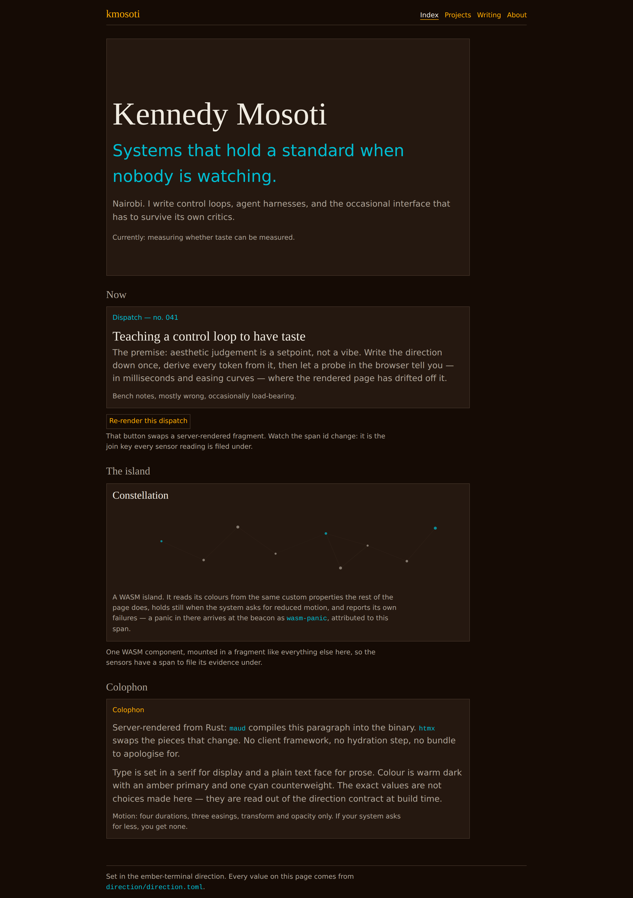

# Round 4 — the hero, end to end

A transcript of one real gauntlet round: four candidates in, one promoted to the
live site. Nothing here is staged. The commands are the ones in the README, the
verdicts are what the CLIs actually returned, and the evidence they were computed
from is committed under `round-4/` so the claims below can be checked rather than
believed.

This is round **4** because rounds 1–3 were wrong in ways worth recording, and
§7 records them. A loop whose demo shows only the run that worked is advertising,
not evidence.

## 1. Candidates

Four hero fragments, authored across distinct style cells, named by the
convention servo parses (`<part>.<family>.<k>.html`):

| File | Shape | Intent |
|---|---|---|
| `candidates/hero.claude.0.html` | eyebrow → display → lede | conventional editorial opening |
| `candidates/hero.claude.1.html` | bordered card on a surface | the SaaS-shaped control |
| `candidates/hero.claude.2.html` | display → oversized accent line | editorial, no eyebrow |
| `candidates/hero.claude.3.html` | **deliberately broken** | off-allowlist class `hero-shout`, 3000px inline width |

All four are labelled `claude` because one family wrote all four. That is not
incidental — see §6.

The round was given a written part spec (`hero.part-spec.md`) stating what this
hero is for. It matters: it is the difference between asking a critic "which is
better?" and asking "which is closer to this?".

## 2. The round

```bash
uv run python -m ui_servo.cli.servo \
  --candidates demo/candidates --part hero --round 4 \
  --part-spec demo/hero.part-spec.md --out evidence/rounds/4
```

```
round 4 / part hero: 3 ranked, 1 rejected by gates, 3 comparison(s), 1 escalated
  REJECTED hero.claude.3: sanitizer-accepted, no-runtime-errors, no-unknown-class,
                          no-overflow, no-motion-violation, axe-clean,
                          reduced-motion-honoured
  #1 hero.claude.0 (1.5 pts, 1W/1D/0L, blandness 0.671)
  #2 hero.claude.2 (1.5 pts, 1W/1D/0L, blandness 0.668)
  #3 hero.claude.1 (0 pts, 0W/0D/2L, blandness 0.673)
  ESCALATED cmp-01005a64816f: only 1 family voted; a panel needs at least 2
                              decorrelated critics
```

**The broken candidate never reached a judge.** It failed the deterministic gates
and left the round carrying the gate that stopped it — a work item a builder can
act on for zero model tokens. That is the loop's central economy, and it is
visible in `round-4/`: no judge signal references its span.

**#1 and #2 tied on points, and their head-to-head is the comparison that
escalated.** This is worth being precise about, because it decides who chose the
hero. From `round.json`:

| Comparison | A | B | Outcome |
|---|---|---|---|
| `cmp-d130df28c71c` | `hero.claude.0` | `hero.claude.1` | 2–0 for A |
| `cmp-26c1252c854d` | `hero.claude.1` | `hero.claude.2` | 0–2 for B |
| `cmp-01005a64816f` | `hero.claude.0` | `hero.claude.2` | **escalated** — one family eligible |

So the panel decided one thing and declined to decide another. It eliminated the
card, twice, unanimously, on a named anti-reference. It never separated the two
editorial openings — that comparison had a single eligible critic (§6) and the
protocol refuses a verdict on one vote.

The promoted hero is therefore **not a panel choice**. The escalation moved the
decision out of the panel, and the agent running the session took it from there —
recorded, with its grounds and its confidence, in
[`round-4/decision.md`](round-4/decision.md). That file exists because the
evidence cannot establish the claim on its own: a tie plus an escalation looks
identical whether a person deliberated or a script promoted rank one, so who
decided has to be written down or not asserted.

That is the design working. The loop is meant to stop at the calls it cannot make
on the evidence it has, rather than manufacture a ranking to look decisive.

## 3. What the critics said

Two families judged (the third built the candidates and was excluded from judging
them). Both had to cite selectors; a finding without one is rejected and re-asked.
Verdicts in full under `round-4/evidence/`.

> **gemini** · winner A · confidence 1.00
> *"Uses `bg-surface` and `border-border`, directly violating the explicit
> anti-reference constraint against card-like [framing]"*

> **codex** · winner A · confidence 0.96
> *"Candidate B puts the entire hero inside a padded `bg-surface` and
> `border-border` panel, exactly the card-like anti-reference"*

Two decorrelated families, judging blind, rejected the same candidate and named
the same anti-reference — a line of `direction/direction.toml` — as the reason.
That is the taste machinery doing the one thing a generic "is this good UI?"
prompt cannot: scoring against a written direction instead of against the corpus
median.

Blandness is measured, not asserted: each survivor's style vector is compared to
an anti-corpus of stock-template samples. The three cluster tightly
(0.668–0.673), which is a fair report of a weak signal from a single builder
family rather than a result.

## 4. The bug this round found in the site

The panel rejected the card. The site was then serving **every fragment inside a
card** — `[data-fragment] { background: var(--color-surface); border: … }` in
`site.css`, hung off the attribute the *probe* uses to join evidence. The class-0
gate reads classes in fragment markup, so it could not see this, and the preview
shell the candidates were judged in does not apply it. The loop was rejecting a
shape the stylesheet then imposed on the winner.

Fixed in `site.css` and `fragments::frame`, and pinned by two tests
(`the_frame_imposes_no_visual_chrome`,
`the_sensor_attributes_carry_no_visual_identity`) that fail if visual identity is
ever hung off a sensor attribute again. This is what the round is actually worth:
not "the panel picked a hero", but "the panel's own judgement, taken seriously,
exposed a place where the instrument and the artefact had drifted apart".

## 5. Promotion

```bash
uv run python -m ui_servo.cli.promote --pick demo/candidates/hero.claude.0.html \
  --part hero --round 4
# promoted hero from round 4 -> site/promoted/hero.html
#   sha256 bfbef5ca142423a4219653d89057f7d556d4526c02b0abe6d45884ff736d7f69
```

Promotion re-runs the class-0 sanitiser over the pick, strips the candidate's own
`data-span-id` (the join key belongs to the round; the server stamps a fresh one),
and writes the result under a provenance comment:

```html
<!-- ui-servo: gated round=4 sha256=bfbef5ca… -->
```

The hash covers the part, the round and the body together, not the body alone.
That distinction was a review finding: with a body-only digest, `round=4` could be
edited to `round=99` and the file still loaded, cached and served — attributing
itself to a round that never produced it. A comment cannot hash itself, so the
values it asserts are bound into the preimage instead.

The Rust server verifies that comment **and** the hash — at boot for every
promoted file in release mode, so a tampered pick fails the deploy rather than
the first visitor. Proof it is not decoration:

| Action | Result |
|---|---|
| Serve the promoted hero | `200`, wrapped in a fresh `data-span-id` |
| Append one line to the file by hand | `500` on `/fragments/promoted/hero`; the home page refuses rather than falling back, and the smuggled markup never renders |
| Drop in a fragment with no provenance | refused — "it was never gated" |
| Edit `round=4` to `round=99`, leaving the body alone | refused — the round is inside the hash |
| Reach the file as a static asset, in any encoding | 404; promoted picks are outside the served root, and the server will not start if they are inside it |
| Start in release mode with either of the above | the process does not start |

## 6. Staffing the panel

The first live round escalated **all three** comparisons. Not a bug: with three
judging families and a self-preference guard, a comparison between candidates
from two different families excludes two judges and leaves one, and one vote can
never satisfy "at least two decorrelated critics".

Eligible judges = `panel_families − families({A, B})`. For a three-family panel,
both candidates in a comparison must come from at most one family — hence one
builder family here. Round 4 still escalated one comparison for the same
structural reason, and the report says so rather than quietly averaging it away.

## 7. What the earlier rounds got wrong

Recorded because a demo that hides its failed runs is not evidence.

| Round | Defect | Consequence |
|---|---|---|
| 1 | The preview shell never loaded `site.css` | Candidates were judged **unstyled** — measured contrast 1.0. Both families reported the display font as browser-default serif, which an earlier version of this file wrote up as "the panel found a real font bug in the site". It was not: it was an artifact of the harness. That claim is withdrawn. |
| 1–3 | The regulator ignored `sensor_report.style_sample`; the CLI built no anti-corpus | Blandness reported `n/a` and MAP-Elites placed **zero elites in zero cells**. An earlier version of this file implied the quality-diversity machinery had run in round 1. It had not. |
| 1–3 | No part spec | Critics compared against a global direction with no statement of what *this* part is for. The verdicts were correspondingly vaguer. |
| 4 | `[data-fragment]` chrome (§4) | Found by this round; fixed before promotion. |

Rounds 1–3 are also why the archive is sparsely occupied (`occupied: 2 / 27`):
three of the four rounds could not place an elite, because they could not measure
one.

## 8. The site



The hero at the top of that page is `hero.claude.0`, chosen from the two
candidates the panel left standing (§2), gated at promotion, and served with its
provenance verified at boot. Below it, an htmx fragment swap and a Rust→WASM
island, both instrumented by the same probe that measured the candidates.

Two corrections have been applied to this line. It first said the hero was
"chosen by the panel", which the escalation contradicts. It then said "a human
pick", which overstated the human involvement: the operator set the session's
goal and never saw this comparison. The agent chose, and
[`round-4/decision.md`](round-4/decision.md) says so with its reasoning — that
being the whole governance claim of the method, it is worth getting exactly
right rather than approximately.
